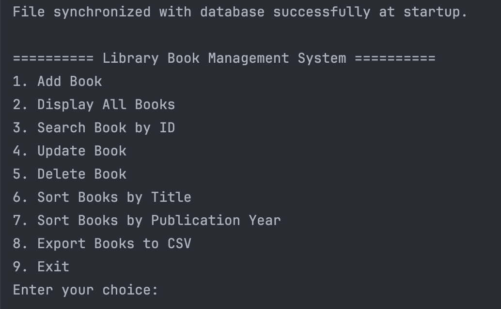
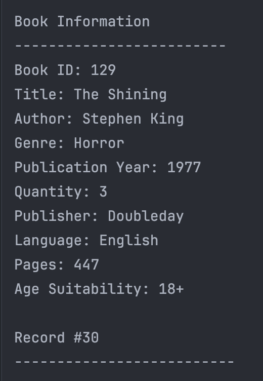

# Record Management System

## Description
A Library Book Management System developed in C++ with MySQL support for storing and managing book records. The application provides a menu-driven command-line interface that allows users to add, display, search, update, and delete book records efficiently. It also includes sorting options, CSV export functionality, and basic input validation and error handling. In addition, the system maintains synchronization between the MySQL database and a file-based copy of the records, combining structured database management with file-based backup and access.

## Getting Started
1. Clone this repository or download the project files.
2. Open the project in your C++ IDE or editor.
3. Make sure the code is compiled as a C++ OOP application, since the project is structured using classes such as `Book`, `FileManager`, `DatabaseManager`, and `BookService`.
4. Run the `main.cpp` file to start the application. Once the program starts, the CLI menu will appear and you can use the available options to add, display, search, update, delete, sort, and export book records.
5. The project also includes an SQL file that should be imported into a MySQL database in order to create the required database structure.
6. After importing the SQL file, open the `DatabaseManager.cpp` file and go to the `connectDB()` function. There, you must enter the correct database connection details, such as host, username, password, database name, and port.
7. Once the database connection is configured correctly, the application will connect to MySQL and perform updates both in the database and in the file-based record storage.

The system has been designed so that the file containing the records stays synchronized with the database. The database acts as the main source of data, while the record file is updated accordingly to reflect the latest changes. In this way, records are stored consistently both in the database and in the file-based copy.

## CLI Menu Overview

The application uses a **Command Line Interface (CLI) menu** to allow the user to interact with the system in a simple and organized way. When the program is executed through `main.cpp`, the menu appears on the terminal and displays all available operations for managing the book records.

Through this menu, the user can choose different options such as adding a new book, displaying all stored books, searching for a specific record by ID, updating an existing record, deleting a record, sorting the records, and exporting them to CSV format. Each option is connected to the corresponding function of the system, making the application easy to navigate and use.

The menu is the main interaction point between the user and the application. It is designed to keep the workflow clear, since the user only needs to enter the number of the desired option and then follow the instructions shown on the screen. This makes the system practical, user-friendly, and suitable for demonstrating all the required functionalities of the project.

The following screenshot shows how the books are displayed through the terminal menu created in the application.

